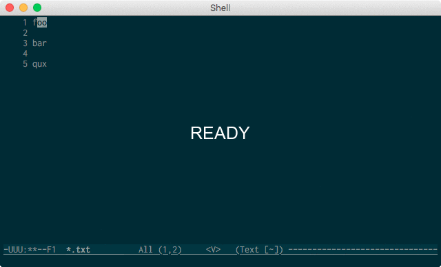

## numbering.el

Provide features like rectangle-number-lines but more interactive.

## Installation

Clone this repository, or install from MELPA. Add the following to your `.emacs`:

```elisp
(add-to-list 'load-path (expand-file-name "~/.emacs.d/site-lisp/numbering.el"))
(require 'numbering)
```

### Configuration example (require [hydra](https://github.com/abo-abo/hydra))

```elisp
(defhydra numbering@hydra (:hint nil
                           :post (numbering-quit))
  "
↑ _p_: incr prev  _c_: incr current  _n_: incr next ↓  _q_: quit
  _P_: skip prev  _d_: decr current  _N_: skip next"
  ("n" numbering-increase-next)
  ("N" numbering-skip-next)
  ("p" numbering-increase-prev)
  ("P" numbering-skip-prev)
  ("c" numbering-increase-curr)
  ("d" numbering-decrease-curr)
  ("q" nil))

(defun hydra+numbering-start ()
  (interactive)
  (numbering-start)
  (numbering@hydra/body))

(defun hydra+numbering-resume ()
  (interactive)
  (numbering-resume)
  (numbering@hydra/body))

(define-key evil-visual-state-map (kbd "C-c s") 'hydra+numbering-start)
(define-key evil-visual-state-map (kbd "C-c r") 'hydra+numbering-resume)
(define-key evil-insert-state-map (kbd "C-c s") 'hydra+numbering-start)
(define-key evil-insert-state-map (kbd "C-c r") 'hydra+numbering-resume)
(define-key evil-normal-state-map (kbd "C-c s") 'hydra+numbering-start)
(define-key evil-normal-state-map (kbd "C-c r") 'hydra+numbering-resume)
```


